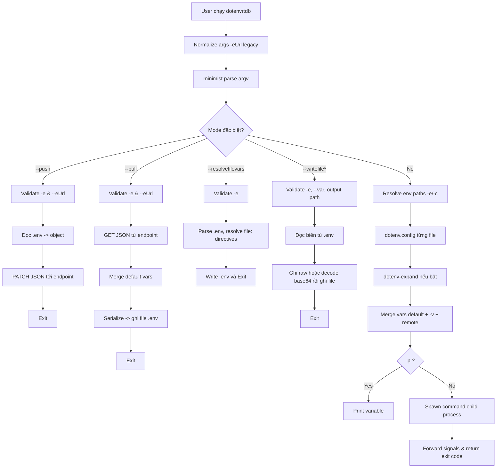
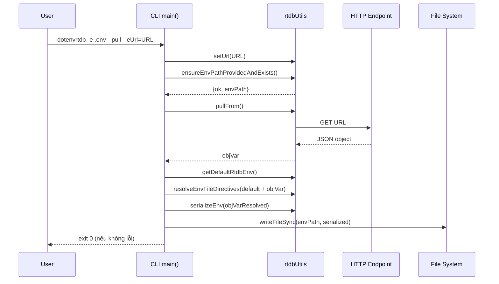

# Phân Tích CLI `dotenvrtdb`

## Tổng Quan CLI

`dotenvrtdb` là một CLI Node.js dùng để:

- Nạp biến môi trường từ một hoặc nhiều file `.env` trước khi chạy command con.
- Hỗ trợ cascade file env theo môi trường (ví dụ `.env`, `.env.local`, `.env.test`, ...).
- Inject biến trực tiếp từ command line (`-v KEY=VALUE`).
- In giá trị biến (`-p VAR`).
- Đồng bộ key/value với HTTP endpoint kiểu Realtime DB qua `--pull` / `--push` dùng `fetch`.
- Resolve directive file trong `.env` theo format `file:raw:<path>` hoặc `file:base64:<path>` bằng `--resolvefilevars`.
- Trích xuất một biến trong `.env` và ghi ra file raw hoặc decode base64 rồi ghi file nhị phân.

Đối tượng sử dụng chính: developer/DevOps muốn chuẩn hóa runtime env cross-platform (đặc biệt có nhắc đến Windows), đồng thời có nhu cầu sync env với endpoint từ xa.

---

## Mức Độ Tin Cậy Của Phân Tích

### Xác nhận chắc chắn từ code

- Entrypoint CLI là `cli.js`, được map qua trường `bin.dotenvrtdb` trong `package.json`.
- Parser CLI dùng `minimist`.
- Nạp `.env` dùng `dotenv`, mở rộng biến dùng `dotenv-expand`.
- Chạy command con dùng `cross-spawn`.
- Có các mode đặc biệt: `--push`, `--pull`, `--resolvefilevars`, `--writefileraw`, `--writefilebase64`.
- Có rewrite tương thích ngược `-eUrl` -> `--eUrl` trước khi parse args.

### Suy luận hợp lý (độ tin cậy cao)

- CLI này là một nhánh mở rộng từ mô hình `dotenv-cli` truyền thống, thêm chức năng RTDB và file artifact.
- `--eUrl` dự kiến hướng đến Firebase Realtime Database REST URL (vừa từ help text vừa từ README/test script).

### Điểm còn mơ hồ / thiếu bằng chứng

- Không có test tự động (unit/integration) để xác thực đầy đủ edge cases.
- Không có schema validation chặt cho payload RTDB (chỉ kiểm tra object/non-array).
- Không có tài liệu chính thức về exit code matrix; cần suy ra từ các `process.exit(...)` trong code.

---

## Entrypoint Và Cách Khởi Chạy

1. **Phân phối CLI**
   - `package.json` khai báo:
     - `main: "cli.js"`
     - `bin: { "dotenvrtdb": "./cli.js" }`
   => khi cài global/local, lệnh `dotenvrtdb` trỏ vào file `cli.js`.

2. **Bootstrap runtime**
   - `cli.js` có shebang `#!/usr/bin/env node`.
   - Parse args bằng `minimist(rtdbUtils.normalizeLegacyArgs(process.argv.slice(2)))`.
   - `main()` là async orchestrator chính, gọi lần lượt:
     - Help/validate argument-level conflict (`-c` + `--override`).
     - Các mode side-effect độc lập (`push/pull/write file`) rồi thoát sớm nếu có mode nào khớp.
     - Nếu không, đi theo luồng nạp env + chạy subprocess.

3. **Mapping command vào runtime**
   - CLI không có subcommand tree kiểu `commander/cobra`; thay vào đó là **flag-driven mode switching**.
   - Command người dùng muốn chạy nằm ở phần positional `argv._` (tốt nhất sau `--`).

---

## Cây Lệnh CLI

> Công cụ này là “single-command CLI” với nhiều chế độ theo flag.

## Cú pháp tổng quát

```bash
dotenvrtdb [flags] [-- command args...]
```

## Nhóm flag chính

### 1) Help / debug / behavior

- `--help`: in hướng dẫn và thoát.
- `--debug`: in danh sách file env sẽ xử lý + object biến sẽ inject, không chạy command con.
- `--quiet`, `-q`: điều khiển chế độ im lặng cho `dotenv` (mặc định quiet=true; có thể tắt bằng `--quiet=false`).
- `-o`, `--override`: cho phép biến từ file đè system env (không dùng chung `-c`).
- `--no-expand`: tắt mở rộng biến bằng `dotenv-expand`.

### 2) Nguồn env local

- `-e <path>`: chỉ định file `.env` (nhiều `-e` được phép).
- `-c [environment]`: bật cascade file env.
  - `-c`: thêm `*.local`.
  - `-c test`: tạo thứ tự `*.test.local`, `*.local`, `*.test`, base file.
- `-v KEY=VALUE`: thêm biến trực tiếp từ CLI (nhiều `-v` được phép).
- `-p VAR_NAME`: in giá trị biến rồi thoát.

### 3) Nguồn env remote / RTDB

- `--eUrl=<url>`: URL endpoint đọc/ghi key-value JSON.
- `--pull`: GET từ `--eUrl`, merge thêm biến mặc định timestamp, rồi ghi đè file `-e`.
- `--push`: đọc file `-e`, parse `.env`, PATCH JSON lên `--eUrl`.
- `--resolvefilevars`: đọc file env tại `-e`, tìm directive `file:raw|base64:path`, thay bằng nội dung file.

> Legacy-compatible:
- `-eUrl=...` hoặc `-eUrl ...` được normalize thành `--eUrl`.

### 4) Artifact từ biến env

- `--writefileraw=<outputPath>` + `--var=<name>` + `-e <path>`:
  đọc biến từ file env và ghi raw text ra file.
- `--writefilebase64=<outputPath>` + `--var=<name>` + `-e <path>`:
  đọc biến base64 từ file env, decode, ghi binary ra file.
- `--resolvefilevars` + `-e <path>`:
  resolve các biến có directive `file:...` mà không cần `--pull`.

### 5) Chạy command con

- Không `--shell`: chạy trực tiếp command bằng `cross-spawn`.
- Có `--shell[=<shell>]`: chạy command qua shell.
- Hỗ trợ inline assignment ở đầu command section khi `--shell` bật (ví dụ `FOO=bar ...`).

## Input channels

- Positional args: command cần chạy (`argv._`).
- Flags/options: như trên.
- Env vars hệ thống (`process.env`).
- File `.env` (1 hoặc nhiều file).
- HTTP response JSON từ `--eUrl` (khi `--eUrl` hoặc `--pull`).

## Output channels

- `stdout`: help, debug output, kết quả `-p`.
- `stderr`: thông báo lỗi validate/IO/network.
- File system: ghi `.env`, file raw, file binary.
- Network side effect: `GET` / `PATCH` tới URL remote.
- Exit code: 0/1 hoặc code của command con.

---

## Dataflow Tổng Thể

1. User chạy `dotenvrtdb` với flags + optional command.
2. CLI normalize legacy args (`-eUrl`), parse toàn bộ args.
3. Nếu có mode độc lập (`--push/--pull/--resolvefilevars/--writefile*`) thì xử lý mode tương ứng và thoát.
4. Nếu không:
   - Xác định danh sách file env từ `-e` hoặc mặc định `.env`, có thể expand theo `-c`.
   - Nạp env file bằng `dotenv.config(...)`.
   - Expand biến (trừ khi `--no-expand`).
   - Nạp biến từ remote URL vào tập biến inject nếu có `--eUrl`.
   - Merge biến mặc định + `-v` + remote vào `process.env`.
5. Nếu có `-p`, in biến và thoát.
6. Parse command section, spawn subprocess (direct hoặc shell mode).
7. Forward signal từ parent sang child; parent exit theo child exit code/signal.

---

## Diagram Kiến Trúc Tổng Quan



---

## Dataflow Theo Từng Use Case Chính

## Use case A: Chạy command với env local

- **Mục đích**: load env rồi chạy command thật.
- **Input**: `-e`, `-c`, `-v`, `--no-expand`, command sau `--`.
- **Validation**:
  - `-c` không đi cùng `--override`.
  - Command bắt buộc phải tồn tại (`cmdArgs.length > 0`).
- **Xử lý**:
  1) Tạo danh sách path env.
  2) `dotenv.config` cho từng path.
  3) Expand env nếu không tắt.
  4) Merge biến bổ sung vào `process.env`.
  5) Spawn command.
- **External interaction**: process spawn.
- **Output**: output command con trực tiếp ra terminal.
- **Error path**: lỗi validate -> `stderr` + exit 1.

## Use case B: `--push`

- **Mục đích**: upload key/value từ `.env` lên endpoint JSON.
- **Input**: `--push --eUrl=... -e path`.
- **Validation**:
  - Phải có `--eUrl`.
  - Phải có `-e` và file tồn tại.
- **Xử lý**:
  1) Đọc file `.env`.
  2) Parse key/value bằng `dotenv.parse`.
  3) Resolve URL placeholder theo env object nếu URL là `%VAR%`/`$VAR`/`${VAR}`/`$env:VAR`.
  4) Gửi `PATCH` JSON.
- **External interaction**: network HTTP PATCH.
- **Output**: không in thành công rõ ràng; lỗi in `stderr`.
- **Error path**: HTTP !ok hoặc exception => exit 1 trong một số nhánh.

## Use case C: `--pull`

- **Mục đích**: tải env JSON từ remote và ghi về file `.env`.
- **Input**: `--pull --eUrl=... -e path`.
- **Validation**: giống `--push`.
- **Xử lý**:
  1) GET JSON.
  2) Merge thêm biến mặc định `DOTENVRTDB_NOW_YYYYDDMMHH`.
  3) Resolve directive `file:<raw|base64>:<path>` (nếu có) trước khi ghi.
  4) Serialize object thành format dòng `KEY=VALUE` (sort key).
  5) Ghi file `-e`.
- **External interaction**: network GET + filesystem write.
- **Output**: file env được cập nhật.
- **Error path**: lỗi ghi file/network => `stderr`, thường exit 1.

## Use case E: `--resolvefilevars`

- **Mục đích**: chạy riêng luồng resolve `file:...` trong file env, không cần pull.
- **Input**: `--resolvefilevars -e path`.
- **Validation**:
  - Phải có `-e` và file tồn tại.
- **Xử lý**:
  1) Parse file `.env`.
  2) Với value match `file:raw:<path>`: đọc UTF-8 từ file.
  3) Với value match `file:base64:<path>`: đọc binary và encode base64.
  4) Nếu file không tồn tại: giữ nguyên value gốc, ghi warning.
  5) Ghi ngược lại `.env`.
- **Output**: file `.env` được cập nhật tại chỗ.

## Use case D: `--writefileraw` / `--writefilebase64`

- **Mục đích**: tạo artifact từ biến env trong file `.env`.
- **Input**: `-e`, `--var`, và một trong hai output flag.
- **Validation**:
  - output path không rỗng.
  - `--var` tồn tại.
  - `-e` tồn tại và file có key.
  - với base64: payload hợp lệ.
- **Xử lý**:
  - Đọc `.env` -> parse -> lấy key.
  - Raw mode: ghi trực tiếp UTF-8.
  - Base64 mode: decode strict rồi ghi binary.
- **External interaction**: filesystem read/write.
- **Output**: file artifact.
- **Error path**: key thiếu/base64 lỗi/ghi lỗi => exit 1.

---

## Bảng Input / Output

| Command/Mode | Input source | Input schema | Output format | Side effects | Error output |
|---|---|---|---|---|---|
| Standard run (`dotenvrtdb ... -- cmd`) | flags `-e/-c/-v`, env system, optional remote via `--eUrl`, positional command | key/value env + argv list | stdout/stderr của child process | spawn subprocess, signal forwarding | validate fail -> stderr + exit 1 |
| `--push` | `-e` file + `--eUrl` | `.env` text -> object JSON | không có structured output | HTTP PATCH | `[rtdb] ...` messages, có thể exit 1 |
| `--pull` | `--eUrl` + `-e` | remote JSON object | file `.env` text | HTTP GET + write file | `[rtdb]/[pull] ...`, có thể exit 1 |
| `--resolvefilevars` | `-e` | `.env` text có directive `file:...` | file `.env` text đã resolve | read file + write file | warning khi thiếu file, exit 1 khi lỗi IO |
| `--writefileraw` | `-e` + `--var` + output path | string variable | file text utf8 | write file | `[env]/[writefileraw] ...`, exit 1 khi lỗi nghiêm trọng |
| `--writefilebase64` | `-e` + `--var` + output path | base64 string | file binary | decode + write file | invalid base64 -> stderr + exit 1 |
| `-p VAR` | process.env sau merge | var name string | print value/plain line | none | in chuỗi rỗng nếu không tồn tại |

---

## Các Module Chính Và Vai Trò

- **`cli.js` (monolithic module)**
  - Chứa parser setup, help text, validation, orchestrator `main`, spawn child process.
  - Chứa luôn “service” RTDB (`rtdbUtils`) và utility parse/serialize/decode.

- **`rtdbUtils` (IIFE nội bộ trong `cli.js`)**
  - Quản lý URL state (`setUrl`).
  - Pull/push JSON qua HTTP.
  - Parse `.env` file -> object; serialize object -> `.env` text.
  - Hỗ trợ decode base64 strict.
  - Hỗ trợ normalize args tương thích cũ.

- **`test/app.js`**
  - Utility script để quan sát env runtime, masking key nhạy cảm.
  - Hữu ích làm smoke check hành vi inject env.

- **`test/*.cmd`**
  - Script mẫu chạy tay cho `writefileraw`, `writefilebase64`, và gọi package qua `npx`.

---

## External Dependencies Và Tích Hợp

- `minimist`: parse argv thành object flags + positional.
- `dotenv`: đọc file `.env` vào `process.env`.
- `dotenv-expand`: expansion biến tham chiếu chéo trong env.
- `cross-spawn`: spawn command con tương thích cross-platform.
- `fetch` (global Node runtime): giao tiếp HTTP tới RTDB/API endpoint.
- Core Node libs: `fs`, `path`.

Tác động dataflow:
- `dotenv` + `dotenv-expand` định hình phase “ingest/transform env”.
- `cross-spawn` quyết định phase “execution adapter” ra process ngoài.
- `fetch` tạo nhánh network IO cho sync remote.

---

## Cấu Hình, Biến Môi Trường, Và Nguồn Dữ Liệu

## Config path

- Mặc định: `.env` tại working directory.
- Tùy chỉnh bằng `-e path` (nhiều path hợp lệ).
- Với `-c`, danh sách path được mở rộng theo quy tắc cascade.

## Env vars

- Nạp từ file `.env`.
- Nạp từ `-v KEY=VALUE`.
- Nạp từ remote URL khi có `--eUrl` (ở flow thường: chỉ merge vào runtime, không ghi file).
- Biến mặc định nội bộ: `DOTENVRTDB_NOW_YYYYDDMMHH`.

## Precedence (quan sát từ code)

1. `dotenv.config` chạy trước (theo thứ tự mảng path).
2. `dotenv-expand` chạy sau khi load env file.
3. `Object.assign(process.env, parsedVariables)` chạy cuối, nên biến từ `-v`/remote/default đè lên giá trị trước đó.
4. Nếu bật `--override`, bản thân `dotenv.config` có thể đè system env ở pha load file.

## Nguồn dữ liệu I/O

- Input: CLI args, env hệ thống, file env, HTTP JSON.
- Output: terminal, file env/file artifact, HTTP requests, exit code.

---

## Error Handling Và Exit Behavior

- Validation lỗi thường in `console.error(...)` rồi `process.exit(1)`.
- Một số nhánh mode đặc biệt trả `true` sau khi báo lỗi thiếu tham số (để kết thúc mode), sau đó main thoát `0`; đây là hành vi không hoàn toàn nhất quán.
- Khi command con chạy:
  - parent kế thừa stdio (`stdio: inherit`), nên output đi thẳng terminal.
  - parent thoát theo exit code child; nếu child kết thúc theo signal thì parent tự kill theo signal đó.
- Top-level catch: mọi exception chưa xử lý trong `main` -> in lỗi -> exit 1.

---

## Luồng Thực Thi Minh Họa

1. `dotenvrtdb -e .env -- node server.js`
   - Input: `.env`, command `node server.js`.
   - Internal flow: parse args -> load `.env` -> expand -> spawn node.
   - Output: log của `server.js`, exit code phản chiếu từ node child.

2. `dotenvrtdb -e .env --push --eUrl=https://example.com/env.json`
   - Input: file `.env` + URL.
   - Internal flow: validate -> parse `.env` -> PATCH JSON.
   - Output: không in thành công tường minh; lỗi network in stderr.

3. `dotenvrtdb -e .env --pull --eUrl=https://example.com/env.json`
   - Input: URL + file đích.
   - Internal flow: GET JSON -> merge timestamp var -> resolve `file:...` -> serialize sorted -> ghi `.env`.
   - Output: file `.env` mới.

4. `dotenvrtdb -e .env --writefilebase64=cert.p12 --var=CERT_B64`
   - Input: key base64 trong `.env`.
   - Internal flow: read key -> strict decode -> write binary file.
   - Output: `cert.p12`.

5. `dotenvrtdb -e .env --resolvefilevars`
   - Input: file `.env` có directive `file:...`.
   - Internal flow: parse env -> đọc file theo directive -> cập nhật value -> ghi ngược `.env`.
   - Output: `.env` đã hydrate value từ file.

---

## Diagram Chi Tiết

### Sequence cho use case `--pull`



---

## Tóm Tắt Cho Người Bảo Trì

- `dotenvrtdb` là CLI “dotenv runner + remote env sync + env-to-file artifact”.
- Đường đi dữ liệu chính:
  - **run mode**: args -> load/transform env -> spawn command.
  - **sync mode**: args -> file/env object <-> HTTP JSON -> file/remote.
- Nếu muốn maintain nhanh, nên đọc theo thứ tự:
  1. `main()` trong `cli.js` (orchestration).
  2. Nhóm hàm `execute*` (các mode behavior).
  3. `rtdbUtils` (IO + helper logic).
  4. `printHelp()` để đối chiếu CLI contract với code thực thi.
